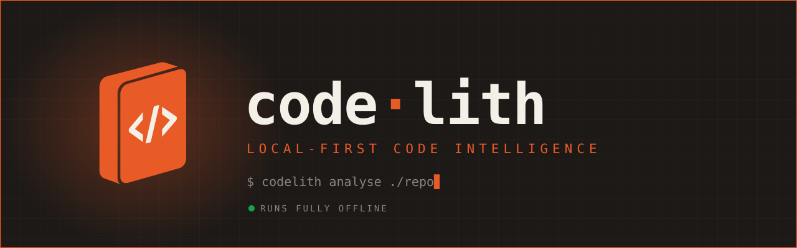
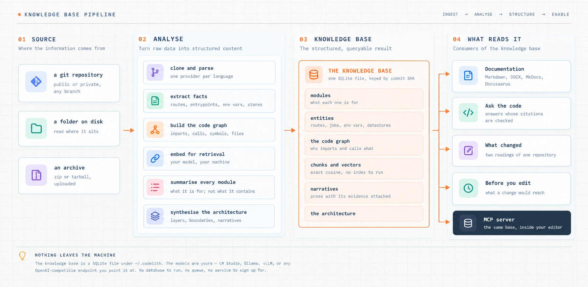

# Codelith

  

Your coding agent re-reads your repository from scratch every session, by grepping.

Codelith reads it **once**: every file, route, entrypoint, module boundary and
dependency. That reading becomes a **knowledge base**, pinned to the commit it was
taken from. Then it serves that reading back, to your editor over MCP, to a
question-answering app with checked citations, to a documentation writer, and to a
diff that tells you what moved between two commits.

!!! note "The sentence the whole design rests on"
    **Analysis is the product. The apps are what it unlocks.**

    Analysis runs once per commit and takes no document type. It must not, or the apps
    stop being interchangeable. Everything downstream reads the stored knowledge base,
    and none of them re-open the repository.

Everything runs on your machine. The knowledge base is one SQLite file under
`~/.codelith`, and the models are whichever OpenAI-compatible endpoint you point it at.
There is no database to run, no queue, no vector service, and no account anywhere.

  

## Where to start

- **[Install](getting-started/install.md)** — Docker in one command, or from source.
- **[Your first analysis](getting-started/first-analysis.md)** — point it at a repository and watch what it does.
- **[Models](getting-started/models.md)** — three tiers, local or hosted, and why you never configure an embedding width.

## How it actually works

The README is a pitch. These pages are the mechanism.

| Page | What it answers |
|---|---|
| [Analysis](how-it-works/analysis.md) | The ten stages of one reading, what each writes, and where it stops |
| [The knowledge base](how-it-works/knowledge-base.md) | Every table, and what is in it |
| [Chunks and retrieval](how-it-works/chunks-and-retrieval.md) | How source is split, embedded, and found again |
| [The code graph](how-it-works/code-graph.md) | Six tables, and what they can and cannot answer |
| [Languages](how-it-works/languages.md) | What is supported, what each provider extracts, how to add one |

## What reads the knowledge base

[Four apps](apps.md) and [an MCP server](mcp.md). Adding an app means one registry
entry and one page, never a change to analysis — and that is enforced by a test, not
by convention.

## What this is not

Being clear about this saves time.

- **Not a hosted service.** There is no server to sign up for. It runs on your machine
  and reads your code there.
- **Not a linter.** It does not judge your code. It reads it, stores what it found, and
  answers questions about it.
- **Not an agent that edits for you.** It is read-only. What it gives an agent is the
  context to edit well; the editing is still yours.
- **Not magic about correctness.** Analysis is a model reading your code. The design
  puts checkable evidence under everything it claims — citations resolved against
  retrieved chunks, call edges only where the callee is unambiguous — but a summary is
  still a summary, and the pages here say where the seams are.
